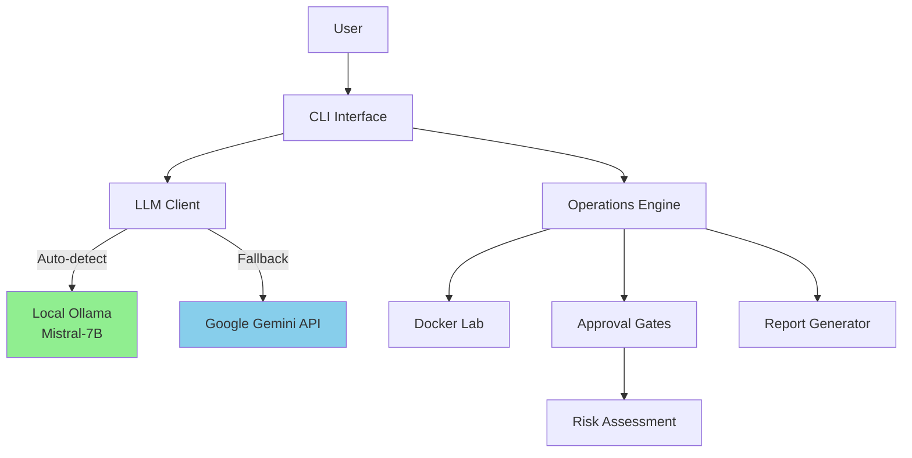

# MEDUSA - AI-Powered Autonomous Penetration Testing Framework

[]()
[]()
[]()

⚠️ **SECURITY RESEARCH PROJECT - EDUCATIONAL USE ONLY**

## 🎯 Overview

MEDUSA (Multi-Environment Detection and Understanding System for Autonomous testing) is an AI-powered penetration testing framework that combines Google Gemini's large language model capabilities with traditional security testing tools. It provides autonomous security assessment through intelligent decision-making in controlled, authorized test environments.

**Key Features:**
- 🤖 **AI-Powered Decision Making** - Google Gemini analyzes targets and recommends actions
- 🛡️ **Approval Gates** - Risk-based approval system prevents unintended actions
- 🎮 **Three Modes** - Observe (read-only), Autonomous (AI-driven), Shell (interactive)
- 🐳 **Comprehensive Lab** - 8 vulnerable Docker services for safe testing
- 📊 **Rich Terminal UI** - Beautiful progress indicators and real-time feedback
- 📝 **Detailed Reporting** - JSON logs and HTML reports with MITRE ATT&CK mapping

## ⚡ Quick Start

### Option 1: Docker Lab (Recommended)

Get the full vulnerable environment running in 3 commands:

```bash
cd lab-environment
cp .env.example .env
docker-compose up -d
```

**Access Services:**
- 🌐 EHR Web Portal: http://localhost:8080
- 📊 API Documentation: http://localhost:3000/api/docs
- 🔍 Log Viewer: http://localhost:8081

See [Docker Quick Start](docs/getting-started/QUICK_START_DOCKER.md) for full guide.

### Option 2: CLI Agent

Install just the MEDUSA AI agent:

```bash
cd medusa-cli
pip install -e .
export GOOGLE_API_KEY="your_key_here"
medusa observe --target localhost
```

See [CLI Quick Start](docs/getting-started/QUICK_START.md) for detailed instructions.

## 🧠 AI Brain Setup

MEDUSA uses AI for intelligent decision-making during penetration tests. You have two options:

### Option 1: Local LLM (Recommended) ⭐

**Unlimited usage, zero cost, complete privacy.**

```bash
# Install Ollama
curl -fsSL https://ollama.com/install.sh | sh

# Pull AI model
ollama pull mistral:7b-instruct

# MEDUSA will auto-detect and use local LLM
medusa observe scanme.nmap.org
```

**Benefits:**
- ✅ No rate limits or daily quotas
- ✅ Zero ongoing costs
- ✅ Complete data privacy (runs offline)
- ✅ Predictable performance

**Requirements:**
- 8GB+ RAM (16GB recommended)
- ~4GB storage for model

📚 **[Full Ollama Setup Guide](docs/OLLAMA_SETUP.md)**

### Option 2: Google Gemini API

**Fastest inference, but rate-limited on free tier.**

```bash
# Set API key
export GEMINI_API_KEY="your-api-key-here"

# Use Gemini
medusa observe scanme.nmap.org --provider gemini
```

⚠️ **Note:** Free tier limited to ~3 scans/day (15 req/min). Local LLM has no limits.

**Get API key:** [https://ai.google.dev/gemini-api/docs/quickstart](https://ai.google.dev/gemini-api/docs/quickstart)

### Configuration

Set your preferred provider in `~/.medusa/config.yaml`:

```yaml
llm:
  provider: auto  # "local", "gemini", "mock", or "auto"
  model: mistral:7b-instruct
  ollama_url: http://localhost:11434
  temperature: 0.7
  timeout: 60
```

### Hardware Requirements

| Component | Minimum | Recommended |
|-----------|---------|-------------|
| RAM | 8GB | 16GB+ |
| Storage | 10GB | 20GB+ |
| GPU | None | NVIDIA/AMD (optional, for speed) |
| Internet | No (local) | Yes (Gemini only) |

**Performance:**
- With GPU: 5-10s per AI decision
- CPU only: 10-30s per AI decision
- Still faster than manual analysis!

## 🏗️ Architecture



## 📦 Project Structure

```
project-medusa/
├── medusa-cli/          # 🤖 AI agent (Python)
├── medusa-backend/      # 🔌 FastAPI REST API
├── medusa-webapp/       # 🌐 Next.js frontend
├── lab-environment/     # 🐳 Docker vulnerable infrastructure
├── training-data/       # 📚 AI training datasets (MITRE ATT&CK)
├── docs/                # 📖 Documentation
├── scripts/             # 🛠️ Automation scripts
└── archive/             # 📦 Deprecated components
```

### Core Components

| Component | Description | Tech Stack |
|-----------|-------------|------------|
| **medusa-cli** | Main AI agent with LLM integration | Python 3.9+, Typer, Rich |
| **medusa-backend** | REST API for patient/employee data | FastAPI, Python 3.11+ |
| **medusa-webapp** | Healthcare portal interface | Next.js 15, React, TypeScript |
| **lab-environment** | 8 vulnerable Docker services | Docker, Docker Compose |
| **training-data** | MITRE ATT&CK training datasets | JSON datasets |

## 🎮 Usage Modes

### Observe Mode (Safe, Read-Only)
```bash
medusa observe --target localhost --port 8080
```
Watch what MEDUSA would do without executing actions. Perfect for learning.

### Autonomous Mode (AI-Driven with Approval)
```bash
medusa autonomous --target localhost --approve-low
```
AI makes decisions with approval gates for high-risk actions.

### Shell Mode (Interactive)
```bash
medusa shell --target localhost
```
Interactive command execution with AI suggestions.

## 🎯 MITRE ATT&CK Coverage

MEDUSA tests **32+ techniques** across **8 tactics**:

- ✅ Initial Access (3 techniques)
- ✅ Execution (4 techniques)
- ✅ Persistence (3 techniques)
- ✅ Privilege Escalation (4 techniques)
- ✅ Defense Evasion (4 techniques)
- ✅ Credential Access (5 techniques)
- ✅ Discovery (5 techniques)
- ✅ Collection (4 techniques)

See [MITRE ATT&CK Mapping](docs/architecture/MITRE_ATTACK_MAPPING.md) for complete details.

## 🔒 Security & Legal

### ⚠️ Important Disclaimers

**Educational Purpose Only** - This project contains intentional security vulnerabilities for:
- Academic security research
- Authorized penetration testing practice
- Defensive security strategy development
- Cybersecurity education and training

**Prohibited Uses:**
- ❌ Unauthorized system access
- ❌ Malicious activities
- ❌ Real-world attacks without explicit permission
- ❌ Any illegal activities

**Legal Compliance:** Users are responsible for ensuring compliance with all applicable laws including Computer Fraud and Abuse Act (CFAA), HIPAA, GDPR, and local regulations.

See [SECURITY.md](docs/SECURITY.md) for complete security policy and legal information.

## 📚 Documentation

### Essential Reading
- 📖 [Documentation Index](docs/README.md) - Start here for all documentation
- 🏗️ [Architecture](docs/ARCHITECTURE.md) - System design and components
- 🚀 [Deployment Guide](docs/DEPLOYMENT.md) - Installation and configuration
- 🛠️ [Development Guide](docs/DEVELOPMENT.md) - Contributing and development setup
- 🔒 [Security Policy](docs/SECURITY.md) - Critical security information

### Getting Started
- ⚡ [Quick Start (CLI)](docs/getting-started/QUICK_START.md)
- 🐳 [Quick Start (Docker)](docs/getting-started/QUICK_START_DOCKER.md)

### Technical Details
- 🌐 [Network Architecture](docs/architecture/NETWORK_ARCHITECTURE.md)
- 🎯 [MITRE ATT&CK Mapping](docs/architecture/MITRE_ATTACK_MAPPING.md)

### Component Documentation
- [medusa-cli README](medusa-cli/README.md) - CLI agent details
- [medusa-backend README](medusa-backend/README.md) - API documentation
- [medusa-webapp README](medusa-webapp/README.md) - Frontend details
- [lab-environment README](lab-environment/README.md) - Lab setup
- [training-data README](training-data/README.md) - Training datasets

## 🛠️ Development

### Prerequisites
- Python 3.9+
- Node.js 18+
- Docker Desktop 20.10+
- Google Gemini API key

### Setup Development Environment

```bash
# Clone repository
git clone <repository-url>
cd project-medusa

# Run setup script
./scripts/setup-dev.sh

# Start Docker lab
cd lab-environment && docker-compose up -d

# Install CLI
cd ../medusa-cli && pip install -e ".[dev]"

# Run tests
pytest tests/ -v
```

See [Development Guide](docs/DEVELOPMENT.md) for complete setup instructions.

### Running Tests

```bash
# CLI tests
cd medusa-cli
pytest --cov=medusa --cov-report=html

# Backend tests
cd medusa-backend
pytest tests/ -v

# Frontend tests
cd medusa-webapp
npm test
```

## 🤝 Contributing

We welcome contributions! Please follow these steps:

1. **Read the Docs** - Review [Development Guide](docs/DEVELOPMENT.md)
2. **Fork Repository** - Create your feature branch
3. **Make Changes** - Follow coding standards
4. **Add Tests** - Ensure test coverage
5. **Update Docs** - Document new features
6. **Submit PR** - Create pull request with clear description

### Contribution Guidelines
- Follow [Conventional Commits](https://www.conventionalcommits.org/)
- Write tests for new features
- Update documentation
- Maintain security best practices

## 📊 Project Status

| Component | Status | Test Coverage | Documentation |
|-----------|--------|---------------|---------------|
| CLI Agent | ✅ Stable | 80%+ | ✅ Complete |
| Backend API | ✅ Stable | 70%+ | ✅ Complete |
| Frontend | ✅ Stable | 60%+ | ✅ Complete |
| Lab Environment | ✅ Stable | N/A | ✅ Complete |
| Training Data | ✅ Complete | N/A | ✅ Complete |

## 🎓 Educational Use Cases

MEDUSA is designed for:
- **University Courses** - Cybersecurity curriculum
- **Security Certifications** - CEH, OSCP, GPEN preparation
- **Red Team Training** - Attack simulation practice
- **Blue Team Training** - Detection and response
- **CTF Competitions** - Capture the Flag events
- **Research Projects** - AI in cybersecurity research

## 🏆 Features

### AI-Powered Agent
- Google Gemini integration for intelligent decision-making
- Context-aware recommendations
- Natural language explanations
- Adaptive attack strategies

### Approval Gates
- Risk-based approval system (LOW, MEDIUM, HIGH, CRITICAL)
- Configurable auto-approval policies
- Human-in-the-loop for high-risk actions
- Audit trail of all decisions

### Lab Environment
- 8 vulnerable services with realistic scenarios
- Network segmentation (DMZ + Internal)
- Comprehensive logging and monitoring
- Easy reset and cleanup

### Reporting
- HTML reports with visualizations
- JSON structured data
- MITRE ATT&CK technique coverage
- Timeline of activities

## 📈 Roadmap

### Phase 1 (Complete)
- ✅ Docker lab environment
- ✅ CLI with basic operations
- ✅ LLM integration (Gemini)
- ✅ Approval gates system
- ✅ Comprehensive documentation

### Phase 2 (In Progress)
- 🔄 Advanced LLM prompts
- 🔄 Enhanced reporting
- 🔄 Additional vulnerable services
- 🔄 Training data expansion

### Phase 3 (Planned)
- 📋 Fine-tuned local LLM models
- 📋 Multi-agent coordination
- 📋 Real-time web dashboard
- 📋 Cloud deployment templates
- 📋 Plugin system for tools

## 🙏 Acknowledgments

MEDUSA is inspired by:
- [OWASP WebGoat](https://owasp.org/www-project-webgoat/)
- [DVWA](https://github.com/digininja/DVWA)
- [Metasploitable](https://github.com/rapid7/metasploitable3)
- [VulnHub](https://www.vulnhub.com/)

Built with:
- [Google Gemini](https://ai.google.dev/) - AI capabilities
- [Typer](https://typer.tiangolo.com/) - CLI framework
- [Rich](https://rich.readthedocs.io/) - Terminal UI
- [FastAPI](https://fastapi.tiangolo.com/) - Backend API
- [Next.js](https://nextjs.org/) - Frontend framework
- [Docker](https://www.docker.com/) - Containerization

## 📄 License

This project is licensed under the MIT License - see [LICENSE](LICENSE) file for details.

## ⚖️ Legal Disclaimer

**THE SOFTWARE IS PROVIDED "AS IS" WITHOUT WARRANTY OF ANY KIND.**

Users are solely responsible for:
- Obtaining proper authorization before testing
- Complying with all applicable laws and regulations
- Any consequences of misuse

The authors and contributors disclaim all liability for misuse of this educational material.

## 📞 Contact & Support

- **Documentation**: [docs/](docs/)
- **Issues**: GitHub Issues
- **Security**: project-medusa-security@[domain]
- **Discussions**: GitHub Discussions

---

**Use Responsibly. Test Ethically. Learn Continuously.**

**Last Updated:** November 3, 2025  
**Version:** 2.0  
**Maintained by:** Project MEDUSA Team
