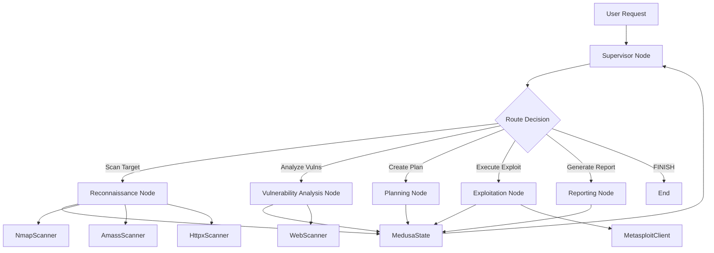

# LangGraph Architecture - MEDUSA Multi-Agent System

## Overview

MEDUSA has been migrated to use **LangGraph SDK** for stateful, cyclic agent orchestration. This provides a more robust and maintainable architecture compared to the previous custom orchestration system.

## Architecture Diagram



## Core Components

### 1. StateGraph

The `MedusaGraph` is a LangGraph `StateGraph` that manages the entire agent workflow:

```python
from langgraph.graph import StateGraph, END
from medusa.core.graph_state import MedusaState
from medusa.core.supervisor import supervisor_node
from medusa.agents.graph_nodes import recon_node, vuln_node, planning_node, reporting_node

def create_medusa_graph():
    graph = StateGraph(MedusaState)
    
    # Add nodes
    graph.add_node("supervisor", supervisor_node)
    graph.add_node("recon", recon_node)
    graph.add_node("vuln", vuln_node)
    graph.add_node("planning", planning_node)
    graph.add_node("reporting", reporting_node)
    
    # Define routing
    graph.add_conditional_edges(
        "supervisor",
        lambda state: state["next_worker"],
        {
            "recon": "recon",
            "vuln": "vuln",
            "planning": "planning",
            "reporting": "reporting",
            "FINISH": END
        }
    )
    
    # All agents return to supervisor
    for node in ["recon", "vuln", "planning", "reporting"]:
        graph.add_edge(node, "supervisor")
    
    graph.set_entry_point("supervisor")
    return graph.compile()
```

**Location**: [`medusa/core/medusa_graph.py`](file:///Users/hidaroz/INFO492/devprojects/project-medusa/medusa-cli/src/medusa/core/medusa_graph.py)

### 2. MedusaState (TypedDict)

The shared state passed between all nodes:

```python
from typing import TypedDict, List, Dict, Any
from langchain_core.messages import BaseMessage

class MedusaState(TypedDict):
    """Global state for the Medusa multi-agent system."""
    messages: List[BaseMessage]
    findings: List[Dict[str, Any]]
    operation_plan: Dict[str, Any]
    current_phase: str
    next_worker: str
```

**Location**: [`medusa/core/graph_state.py`](file:///Users/hidaroz/INFO492/devprojects/project-medusa/medusa-cli/src/medusa/core/graph_state.py)

### 3. Supervisor Node

The Supervisor node routes tasks to specialized agents based on the current state:

```python
def supervisor_node(state: MedusaState) -> MedusaState:
    """Supervisor node that routes to the next worker."""
    current_phase = state.get("current_phase", "reconnaissance")
    
    # Deterministic routing based on phase
    if current_phase == "reconnaissance":
        state["next_worker"] = "recon"
        state["current_phase"] = "vulnerability_analysis"
    elif current_phase == "vulnerability_analysis":
        state["next_worker"] = "vuln"
        state["current_phase"] = "planning"
    elif current_phase == "planning":
        state["next_worker"] = "planning"
        state["current_phase"] = "reporting"
    elif current_phase == "reporting":
        state["next_worker"] = "reporting"
        state["current_phase"] = "complete"
    else:
        state["next_worker"] = "FINISH"
    
    return state
```

**Location**: [`medusa/core/supervisor.py`](file:///Users/hidaroz/INFO492/devprojects/project-medusa/medusa-cli/src/medusa/core/supervisor.py)

### 4. Agent Nodes

Each agent is wrapped as a LangGraph node that:
1. Receives the `MedusaState`
2. Converts it to an `AgentTask`
3. Executes the agent
4. Updates the state with results

Example:

```python
async def recon_node(state: MedusaState) -> MedusaState:
    """Reconnaissance agent node."""
    task = AgentTask(
        task_id=f"recon_{len(state['findings'])}",
        task_type="run_scan",
        parameters={"target": "scanme.nmap.org", "scan_type": "fast"}
    )
    
    result = await recon_agent.run_task(task)
    
    state["findings"].extend(result.findings)
    state["messages"].append(AIMessage(content=f"Recon complete: {len(result.findings)} findings"))
    
    return state
```

**Location**: [`medusa/agents/graph_nodes.py`](file:///Users/hidaroz/INFO492/devprojects/project-medusa/medusa-cli/src/medusa/agents/graph_nodes.py)

### 5. Tool Integration

Each agent has access to real security tools via the `MedusaToolAdapter`:

```python
from medusa.core.tool_adapter import MedusaToolAdapter
from medusa.tools.nmap import NmapScanner

# Wrap Medusa tool for LangChain
nmap_tool = MedusaToolAdapter(NmapScanner())
```

**Integrated Tools**:
- **ReconnaissanceAgent**: `NmapScanner`, `AmassScanner`, `HttpxScanner`
- **VulnerabilityAnalysisAgent**: `WebScanner`
- **ExploitationAgent**: `MetasploitClient`

**Location**: [`medusa/core/tool_adapter.py`](file:///Users/hidaroz/INFO492/devprojects/project-medusa/medusa-cli/src/medusa/core/tool_adapter.py)

## Execution Flow

1. **User initiates operation** → `medusa agent run target.com`
2. **Graph starts** → Supervisor node receives initial state
3. **Supervisor routes** → Decides next agent based on current phase
4. **Agent executes** → Runs tools, updates state with findings
5. **Return to Supervisor** → Supervisor evaluates state and routes to next agent
6. **Repeat** → Continue until operation is complete
7. **Finish** → Supervisor routes to `END` when all phases are done

## Benefits of LangGraph

### 1. Stateful Workflows
- **Persistent state** across agent invocations
- **Cyclic execution** - agents can be revisited based on findings
- **Conditional routing** - dynamic decision-making

### 2. Maintainability
- **Clear separation** between orchestration logic and agent logic
- **Declarative graph structure** - easy to visualize and modify
- **Standard patterns** - Supervisor-Worker is a proven pattern

### 3. Extensibility
- **Easy to add new agents** - just add a new node and routing logic
- **Tool integration** - standardized via `MedusaToolAdapter`
- **Custom routing** - can use LLM-based routing or deterministic logic

### 4. Debugging
- **State inspection** - can view state at any point in the graph
- **Step-by-step execution** - can pause and resume
- **Logging** - built-in support for tracking execution

## Migration from Legacy Architecture

### Before (Custom Orchestrator)

```python
class OrchestratorAgent:
    def run_operation(self, target):
        # Custom delegation logic
        recon_result = self.delegate_to_recon(target)
        vuln_result = self.delegate_to_vuln(recon_result)
        plan = self.delegate_to_planning(vuln_result)
        # ...
```

### After (LangGraph)

```python
graph = create_medusa_graph()
initial_state = {
    "messages": [HumanMessage(content=f"Assess {target}")],
    "findings": [],
    "operation_plan": {},
    "current_phase": "reconnaissance",
    "next_worker": "recon"
}

for state in graph.stream(initial_state):
    print(f"Current phase: {state['current_phase']}")
```

## Configuration

### Dependencies

Add to `requirements.txt`:

```txt
langgraph>=0.0.1
langchain>=0.1.0
langchain-core>=0.1.0
```

### Environment Variables

```bash
# LLM Provider (for agent nodes)
export LLM_PROVIDER=bedrock
export AWS_REGION=us-west-2

# Graph Configuration
export MEDUSA_GRAPH_MODE=async  # or 'sync'
```

## Usage Examples

### Basic Execution

```python
from medusa.core.medusa_graph import create_medusa_graph
from langchain_core.messages import HumanMessage

graph = create_medusa_graph()

initial_state = {
    "messages": [HumanMessage(content="Assess scanme.nmap.org")],
    "findings": [],
    "operation_plan": {},
    "current_phase": "reconnaissance",
    "next_worker": "recon"
}

for state in graph.stream(initial_state):
    print(f"Phase: {state['current_phase']}, Findings: {len(state['findings'])}")
```

### Verification Script

```bash
python3 medusa-cli/verify_graph.py
```

## Future Enhancements

### 1. LLM-Based Supervisor
Replace deterministic routing with LLM-based decision-making:

```python
def supervisor_node(state: MedusaState) -> MedusaState:
    llm_response = llm.invoke(
        f"Given findings: {state['findings']}, what should the next agent be?"
    )
    state["next_worker"] = parse_llm_response(llm_response)
    return state
```

### 2. Parallel Agent Execution
Use LangGraph's parallel execution for independent tasks:

```python
graph.add_parallel_edges(
    "supervisor",
    ["recon", "vuln"],  # Run in parallel
    "planning"  # Merge results here
)
```

### 3. Human-in-the-Loop
Add approval nodes for high-risk actions:

```python
graph.add_node("approval", approval_node)
graph.add_conditional_edges(
    "exploitation",
    lambda state: "approval" if state["risk"] == "HIGH" else "reporting"
)
```

## References

- [LangGraph Documentation](https://langchain-ai.github.io/langgraph/)
- [LangChain Documentation](https://python.langchain.com/)
- [Supervisor-Worker Pattern](https://langchain-ai.github.io/langgraph/tutorials/multi_agent/agent_supervisor/)
